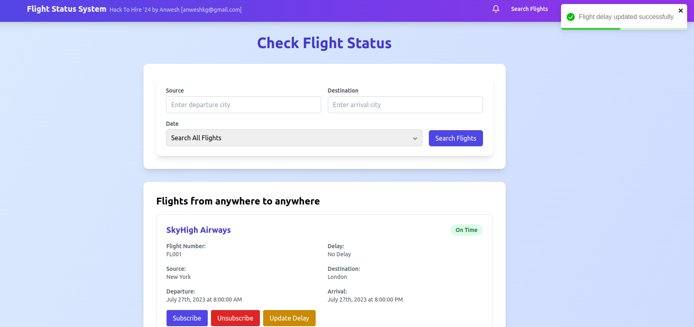
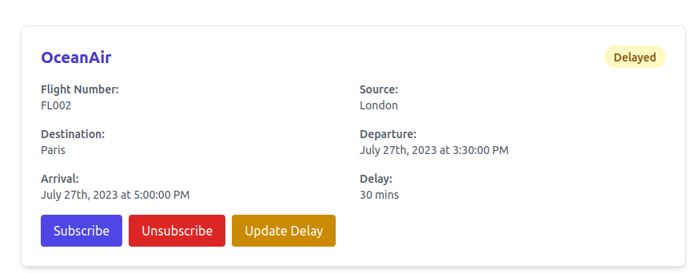
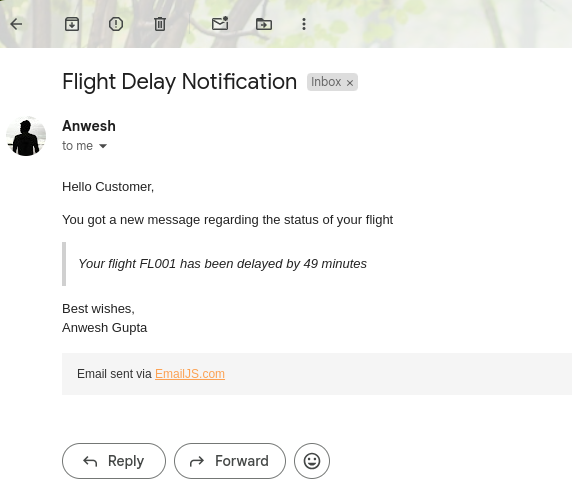
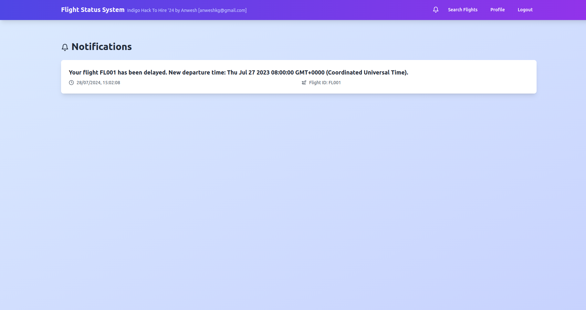
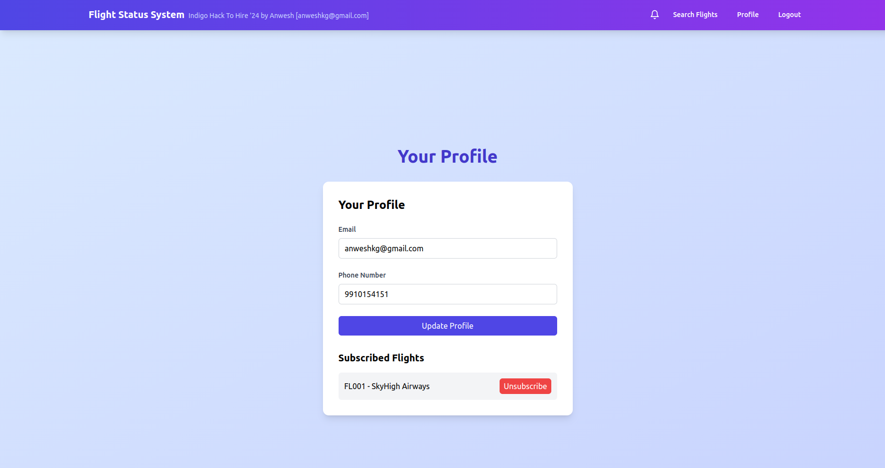
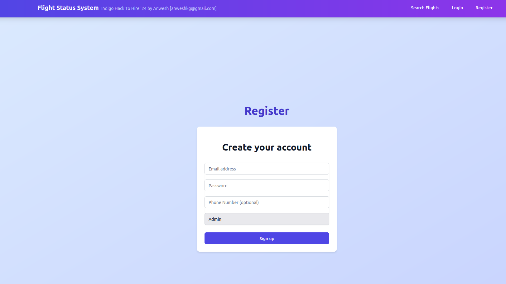

# Flight Status System

A real-time flight status monitoring system built with Next.js, NestJS, Apache Kafka, and PostgreSQL.


**Redhat Openshift Deployemnt:** [flight-status-system-frontend-anweshkg-dev.apps.sandbox-m4.g2pi.p1.openshiftapps.com/](https://flight-status-system-frontend-anweshkg-dev.apps.sandbox-m4.g2pi.p1.openshiftapps.com/)

**Vercel Deployment:** [flight-status-system-two.vercel.app](https://flight-status-system-two.vercel.app)

## Project Overview

This Flight Status System is a comprehensive solution for tracking and notifying users about flight statuses. It leverages modern web technologies and event-driven architecture to provide real-time updates and notifications to users.

 - Start by clicking Search button (may take time on first load due to cold start of servers):


 - On clicking Update Delay, A kakfa event is triggered for the flight and all users subscribed to it are notified:
 



 - You can Edit your profile or see the flights you are subscribed to:


 - Login/Register



### Key Features

- Real-time flight status updates
- User subscription to specific flights
- Multi-channel notifications (Email, SMS, Notifications)
- JWT Authentication for secure user management from scratch
- Responsive design with Tailwind CSS to match Indigo Like Theme
- Context API for state management throughout the App
- TypeORM to seamlessly communicatte with hosted Database
- Used Javascript in frontend and typescript in backend to show compatibility with both

### Tech Stack

- **Frontend:** Next.js with App Router, Tailwind CSS
- **Backend:** NestJS, TypeORM
- **Database:** PostgreSQL
- **Message Broker:** Apache Kafka
- **Authentication:** JWT (JSON Web Tokens)

## Project Structure

The project is divided into two main folders:

```
/
├── frontend/    # Next.js application
└── backend/     # NestJS application
```

## Key Implementations

1. **Event-Driven Architecture:** Utilizes Apache Kafka to handle events such as flight delays, subscriptions, and unsubscriptions.

2. **Real-time Notifications:** On flight delay changes, the system triggers an event in Kafka which sends Email/SMS/Push Notifications to logged-in users.

3. **User Authentication:** Implements JWT authentication from scratch for robust user management.

4. **State Management:** Uses React's Context API to maintain state throughout the application.

5. **Multiple Kafka Topics:** Implements various Kafka topics to trigger notifications based on flight subscribe/unsubscribe/delay changes.

6. **Responsive UI:** Employs Tailwind CSS to create a responsive and visually appealing user interface with an indigo-like theme.

## Getting Started

### Prerequisites

- Node.js (v14 or later)
- PostgreSQL
- Apache Kafka

### Installation

1. Clone the repository:
   ```
   git clone https://github.com/your-username/flight-status-system.git
   ```

2. Install frontend dependencies:
   ```
   cd frontend
   npm install
   ```

3. Install backend dependencies:
   ```
   cd ../backend
   npm install
   ```

4. Set up environment variables for both frontend and backend (refer to `.env.example` files in each directory).

5. Start the development servers:
   - Frontend: `npm run dev` in the `frontend` directory
   - Backend: `npm run start:dev` in the `backend` directory
