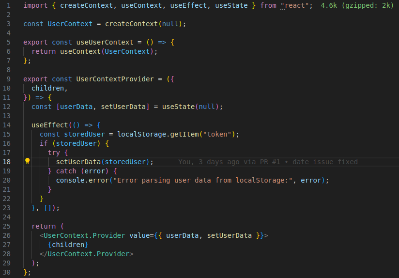

# Flight Status System Frontend

This is the frontend application for the Flight Status System. It's built with Next.js and provides a user interface for viewing flight information, subscribing to flight updates, and managing flight delays (for admin users).

## Features

- User authentication (login and signup)
- Role-based access control (RBAC) with user and admin roles
- View flight information
- Subscribe/unsubscribe to flight updates
- Update flight delays (admin only)
- Responsive design using Tailwind CSS

 - Context API for state management throughout the app:


## Prerequisites

- Node.js (v14 or later)
- npm or yarn

## Setup

1. Clone the repository and navigate to the frontend folder:

   ```bash
   git clone <repository-url>
   cd <repository-name>/frontend
   ```

2. Install dependencies:

   ```bash
   npm install
   # or
   yarn install
   ```

3. Create a `.env.local` file in the root of the frontend folder and add the following environment variables:

   ```
   NEXT_PUBLIC_BACKEND_API=http://localhost:3001  # Adjust this to your backend URL
   ```

4. Start the development server:

   ```bash
   npm run dev
   # or
   yarn dev
   ```

5. Open [http://localhost:3000](http://localhost:3000) with your browser to see the application.

## Project Structure

- `pages/`: Contains the main pages of the application
- `components/`: Reusable React components
- `context/`: React context for global state management (e.g., UserContext)
- `styles/`: Global styles and Tailwind CSS configuration
- `public/`: Static assets

## Available Scripts

- `npm run dev`: Runs the app in development mode
- `npm run build`: Builds the app for production
- `npm start`: Runs the built app in production mode
- `npm run lint`: Runs the linter to check for code style issues

## Contributing

Please read [CONTRIBUTING.md](CONTRIBUTING.md) for details on our code of conduct and the process for submitting pull requests.

## License

This project is licensed under the MIT License - see the [LICENSE.md](LICENSE.md) file for details.